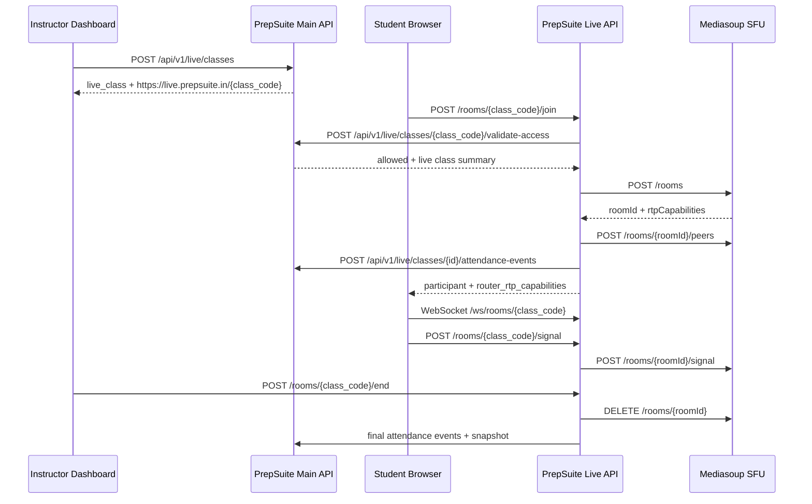

# Phase 14: Live End-to-End Flow

## Goal

Wire the contracts between the PrepSuite main backend, the standalone Live API, and the mediasoup SFU service so a scheduled class can move from tenant-owned schedule data to a live room with participant access, SFU room creation, attendance sync, and clear failure handling.

## Service Responsibilities

| Service | Responsibility |
| --- | --- |
| Main backend | Tenant ownership, app subscription gate, RBAC, class schedule, batch/student/teacher validation, join window, capacity, attendance events, recordings. |
| Live API | JWT validation, runtime room state, participant presence, duplicate-join prevention, chat, raise hand, instructor controls, Main API validation client, SFU client. |
| SFU | Internal-only mediasoup room, peer, transport, producer, and consumer lifecycle. |

## Main Backend Additions

- `Settings.live_api_url` and `Settings.live_api_timeout_seconds` configure outbound calls to the runtime service.
- `LiveRuntimeClient` in `app/modules/live/integration.py` provides typed methods for future backend-to-runtime operations: `get_room`, `join_room`, `leave_room`, `start_room`, and `end_room`.
- Runtime client failures map to consistent PrepSuite errors: `live_runtime_unavailable`, `live_runtime_request_failed`, and `live_runtime_contract_invalid`.

No new database tables are introduced in this phase. The flow uses the Phase 11 live tables:

- `live_classes`
- `live_class_participants`
- `live_class_attendance_snapshots`
- `live_class_recordings`
- `live_class_events`

## End-to-End Sequence



## Failure Handling

| Failure | Handling |
| --- | --- |
| Invalid or expired token | Live API rejects before room access validation. |
| Main API unavailable | Live API returns `main_api_unavailable` with HTTP 503. |
| Main API denies access | Live API returns `live_access_denied` with the denial reason. |
| Expired join window | Main API validation returns `allowed=false` and `join_window_closed`. |
| Class full | Main API and Live API both enforce capacity; runtime returns `room_capacity_full` if the active room is full. |
| Duplicate active participant | Live API rejects with `duplicate_active_connection`. |
| SFU room creation failure | Live API returns `sfu_unavailable`; attendance is not written for a failed join. |
| SFU contract drift | Live API accepts the SFU `rtpCapabilities` field and also supports the older test stub field `routerRtpCapabilities`. Invalid shapes return `sfu_contract_invalid`. |

## Tests

Main backend:

- `tests/live/test_live_runtime_client.py` verifies outbound Live API contract calls and error mapping.

Live API:

- Join validates with the Main API and creates the SFU room/peer.
- Real SFU `rtpCapabilities` responses are accepted.
- Capacity-full, duplicate join, Main API denial, Main API outage, and SFU outage are returned with stable error codes.
- Instructor start/mute/end controls send final attendance snapshots.

SFU:

- Phase 13 room, peer, signaling, and auth tests remain the media-plane contract checks.

## Local Review

```bash
# main backend
uv run pytest tests/live/test_live_runtime_client.py
make check

# live api
uv run pytest
make check

# sfu
npm run check
```

Runtime URLs:

- Main API: `http://localhost:8000/docs`
- Live API: `http://localhost:8010/docs`
- SFU health: `http://localhost:8020/health`
